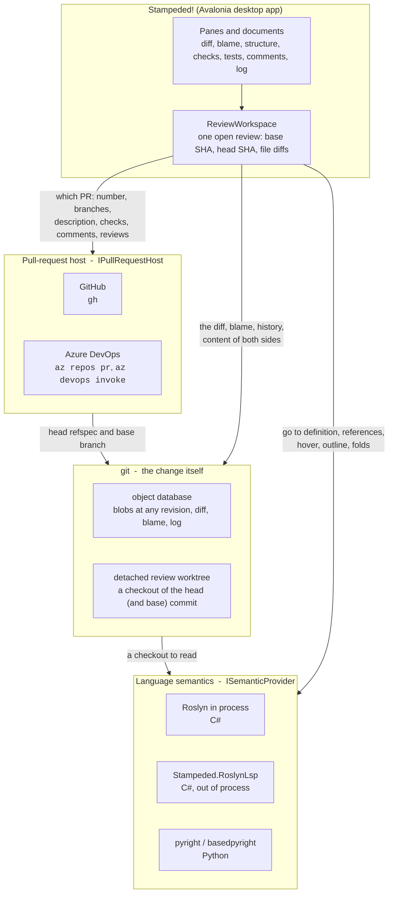
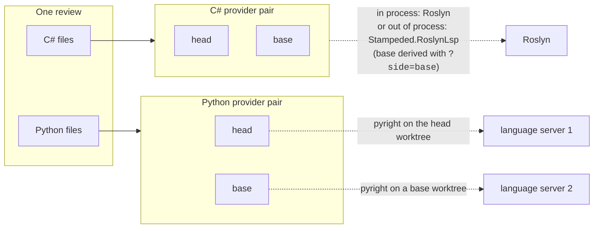
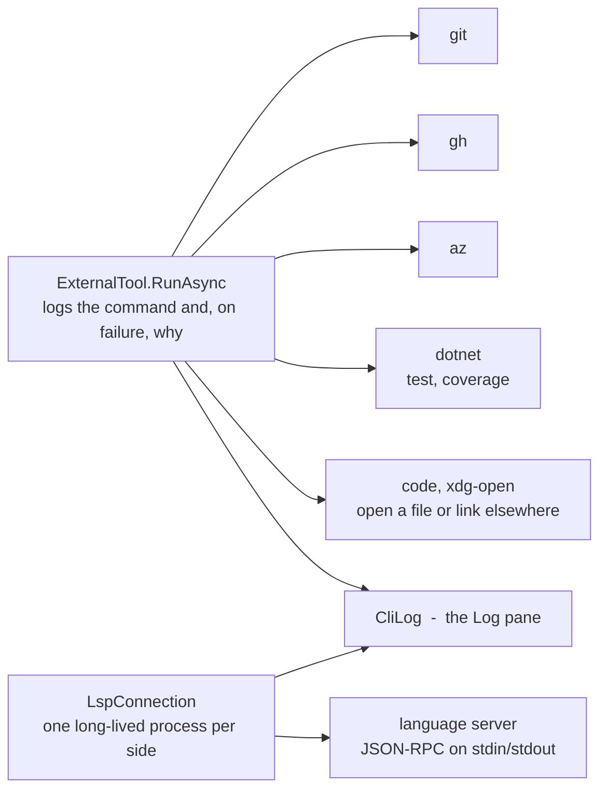

# Architecture

Stampeded! is a code-review tool, and a review is a question about a *change*: two commits and
the difference between them. Everything in the architecture follows from where that change
lives. It lives in git, so git sits in the middle. Everything else is a source of *context*
around it: the pull-request host knows which commits and what people said about them, a
language service knows what the code means, and the rest is presentation.

## The big picture

Read it top to bottom. The app asks the host *which* commits a pull request is; git fetches
them and produces the diff; the language services read a checkout git made. The host never
sees the code, and git never sees the pull request: each layer answers only the question it is
the authority for.

## Why git is in the middle

The pull-request host is asked for the things only it knows: the open list, a description,
review comments, check runs, the merge state, and which commit is the head of a pull request.
It is never asked for file content. Once the two SHAs are known, the change is read from the
local object database: `git diff` for the file list, `git show` for either side of a file,
`git blame` and `git log` for history. That has consequences that shape the rest:

- **Both sides of a diff are real code.** The base side is not a rendered patch; it is a blob
  git handed over, so removed code gets the same navigation as added code.
- **A review survives losing the host.** What the host said is cached under
  `~/.cache/stampeded/prs`. When `gh` or `az` fails and the commits are still in the object
  database, the review opens from the cache, says it is offline, and refuses only what needs
  the host: a verdict or a merge.
- **The user's checkout is never touched.** Reads come from the object database. Anything
  that needs files on disk (a language server, a test run) gets a *detached* worktree under
  `~/.cache/stampeded/worktrees`, so the branch under review is never checked out by the
  tool. Operations that must move a branch (rebase, pull) first ask git which checkout holds
  it and run there.

## Two hosts, one vocabulary

`IPullRequestHost` is decided once per repository, from the URL of `origin`: an Azure DevOps
URL picks `AzureDevOpsService`, anything else is GitHub because `gh` also serves GitHub
Enterprise hosts that nothing could enumerate. `STAMPEDED_PR_HOST` overrides the guess.

Above the interface, the model speaks GitHub's words (`APPROVE`, `REQUEST_CHANGES`,
`MERGEABLE`, `LEFT` / `RIGHT`). Azure DevOps counts votes from 10 to -10 and has no review
object at all, and that translation happens inside its implementation and nowhere else. A pane
learns which host answered only from `HostName`, so a new host is a third implementation, not a
change to the review.

## Languages come through one interface, from two kinds of process

Everything the review asks about source goes through `ISemanticProvider`: what a token means,
where it is declared, who uses it, which member owns a line, the outline, and the fold regions.
A symbol is a `SymbolRef`, a file and a position, because that is all a language server can be
handed back.

A review holds one provider pair per language, head and base, and `SemanticsFor(oldSide,
relPath)` picks the pair by file extension. A Python server starts only for a review that
changes Python. Its base side is a *second* process on a checkout of the base revision: a
language server holds one text per file, so two revisions cannot share one. Only the tool's own
Roslyn server derives base from head, which is what `?side=base` on a document URI means.

Two implementations exist:

- **`RoslynWorkspaceService`** loads the solution in process. It is the default for C# and
  the only provider that can also decompile a definition without source (ILSpy's decompiler,
  offered as a separate capability rather than part of the interface, because a language
  server cannot answer it).
- **`LspSemanticProvider`** speaks JSON-RPC to any language server over its stdin and stdout.
  `Stampeded.RoslynLsp` wraps the same Roslyn logic as a server (`STAMPEDED_SEMANTICS=lsp`),
  which is what proves the interface is honest. pyright reads Python through the same class.

A language server needs an interpreter and a project configuration, neither of which is in the
detached worktree. `PythonEnvironment` finds the reader's own environment (`.venv`, an
activated one, or `python3` on PATH) and hands it to the server. When no server is installed,
the review installs basedpyright into `~/.cache/stampeded/python-lsp` and logs every step;
deleting the directory undoes it.

## Everything external is a command line

There is no HTTP client and no token of the tool's own. Authentication, SSO and token refresh
are whatever `gh auth` and `az login` already did for the user, which is also why nothing had to
be registered as an OAuth application anywhere. Every command goes through one function that
writes the command line to the log, and on failure the first line of its output, so the Log
pane can always explain what was run.

A language server is the one exception to "a command with an exit code": it starts once and
answers until the review closes. It still reaches the log: the command line, slow requests,
and every line of its stderr.

## Other moving parts

- **Diff and folds** (`Stampeded.Core/Diff`): the unified diff is built from git's output and
  the structural folds come from the semantic provider, so a Python file folds by function the
  same way a C# file folds by member.
- **Syntax colours**: TextMate grammars from VS Code, painted per side and transferred onto
  the diff rows, because a grammar is a state machine over consecutive lines and a unified
  diff is consecutive on neither side.
- **Tests and coverage** (`Stampeded.Core/Testing`): `dotnet test` runs in the review worktree,
  results come from the TRX files it wrote, coverage from a cobertura file that
  `dotnet-coverage` wraps around the run. Coverage lands as hit counts per line in the diff.
- **Review state** (`ReviewStateStore`): viewed files and draft comments, JSON per pull
  request in the user data directory. Viewed flags reset on a new head; drafts are anchored to
  content so they re-attach across a force-push.
- **Merge queue** (`Stampeded.Core/MergeQueue`): shared by every reader of the repository
  with no server of its own. The queue is a ref on the remote, pointing at a chain of empty
  commits whose messages carry the queue; a push that does not fast-forward is rejected by the
  server, which is the whole concurrency story. Git in the middle once more.

## Layers in the repository

| Project | Holds | Depends on |
| --- | --- | --- |
| `Stampeded.Core` | git, hosts, diff, semantics, LSP client, review store | no UI |
| `Stampeded` | the Avalonia app: panes, documents, `ReviewWorkspace` | `Stampeded.Core` |
| `Stampeded.RoslynLsp` | Roslyn as a language server | `Stampeded.Core` |
| `Stampeded.Core.Tests` | NUnit, real git repositories in temp directories | `Stampeded.Core` |
