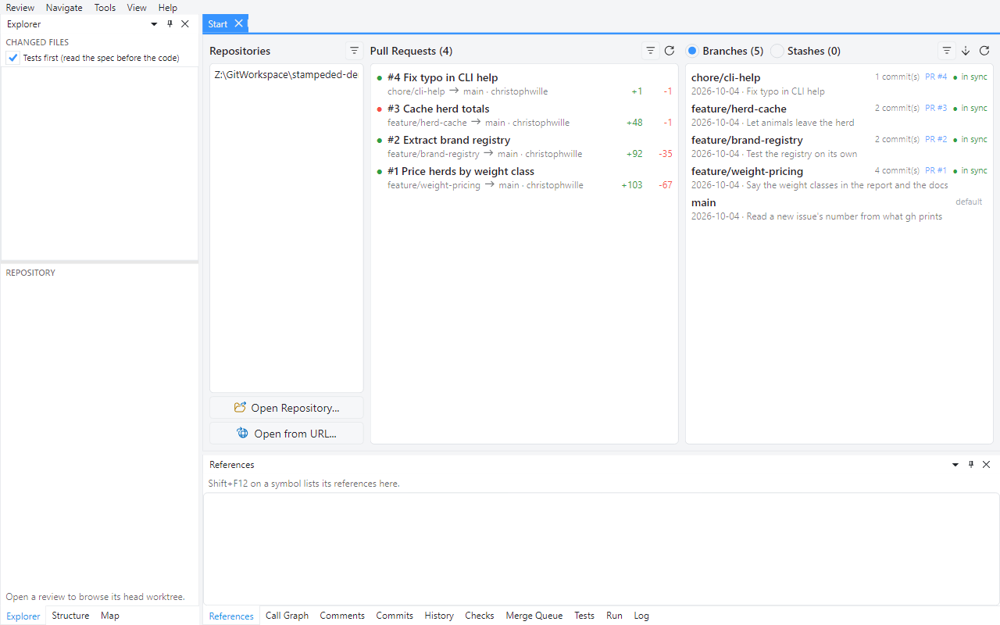
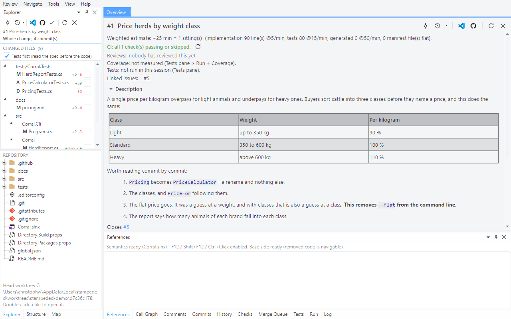
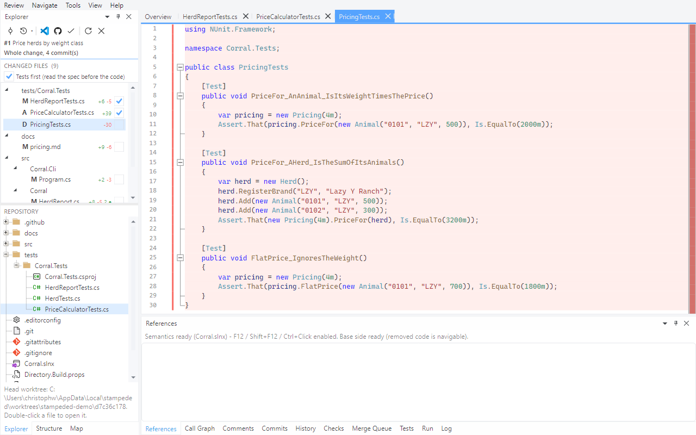
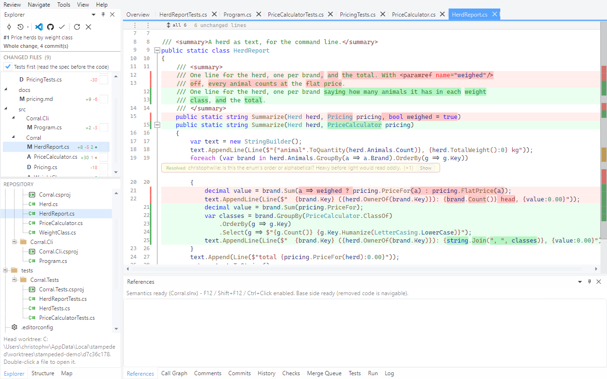

# Tour 1: Open a pull request and read it

Reading a review here is mostly a keyboard job: file by file, hunk by hunk. This tour takes
pull request #1 of the demo repository from the start page to the last file.

## 1. The start page

**Review > Open from URL...**, `christophwille/stampeded-demo`.

Three columns: repositories you've opened recently, the open pull requests with CI state and
size, and your local branches - each with the pull request it belongs to and whether it still
matches the remote. Start typing in any list to filter it.

## 2. The overview

Double-click **#1 Price herds by weight class**.

This is the review's home tab: a rough reading-time estimate, CI, who has reviewed, the
linked issue, the description rendered. The Explorer on the left lists the changed files in
reading order - tests first, since they tell you what the change is supposed to do. Below it
is the whole repository at the pull request's head, not only the files that changed.

Your clone was not touched to get here. The head sits in a detached worktree in the tool's
cache; your working tree and index stay as they were.

## 3. The first file

Press `]`.

`]` and `[` step through the files. You get both line numbers, the changed words inside a
changed line, and syntax colours and folding as in an editor. That's not cosmetic: the diff
really is source code to the tool, which is what tour 2 is about.

## 4. Hunks and viewed flags

`n` and `p` jump between hunks. `v` marks the file viewed and opens the next one - and so does
`n` once you're past the last hunk.

`o` takes you to the overview and back to the file you came from.

## 5. Collapsed context and resolved threads

Unchanged runs collapse into a bar that tells you how many lines it hides. Click it to get
them back, all at once or twenty at a time. A resolved thread shrinks to a single line until
you ask for it. The strip along the right edge is the whole file at a glance: red and green
where it changed, amber where somebody commented.

## 6. Side by side

**View > Side-by-Side Layout**.

Your choice sticks. Either way, a file is one tab.

## 7. Closing and reopening

Quit halfway through and open the pull request again: the files you ticked are still ticked.
That state is local, keyed by repository and pull request - and it's what tour 5 builds on
when the author pushes again.

One oddity in this pull request: the author renamed `Pricing.cs` to `PriceCalculator.cs`, but
you see one file added and one deleted. Over the whole change, too little of the file
survives for git to call it a rename. [Tour 3](03-commit-by-commit.md) reads the same change
commit by commit, and there it is one.

Next: [Navigate the code in the diff](02-navigate-the-code.md)
