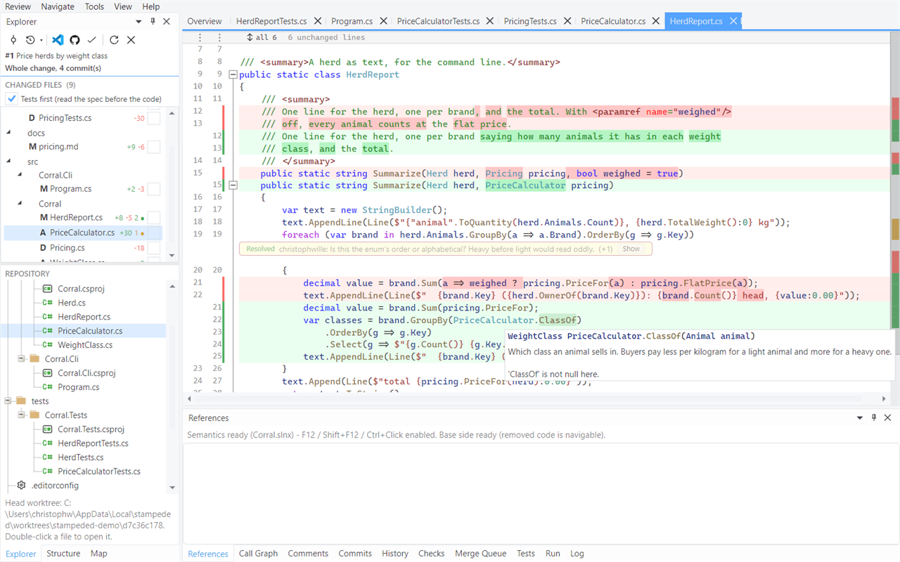
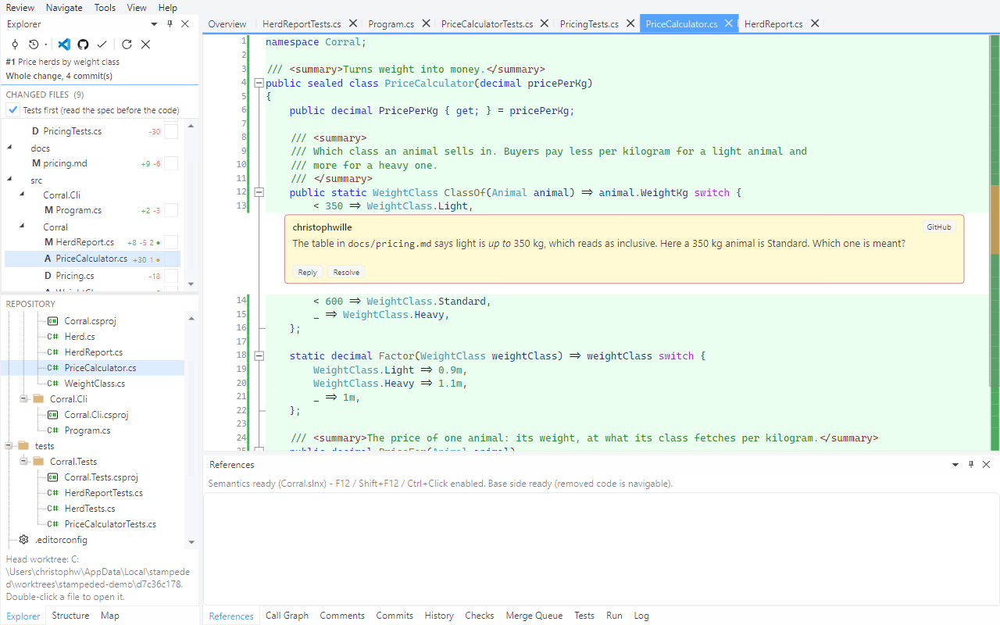
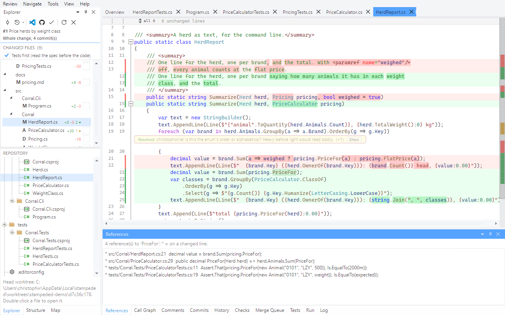
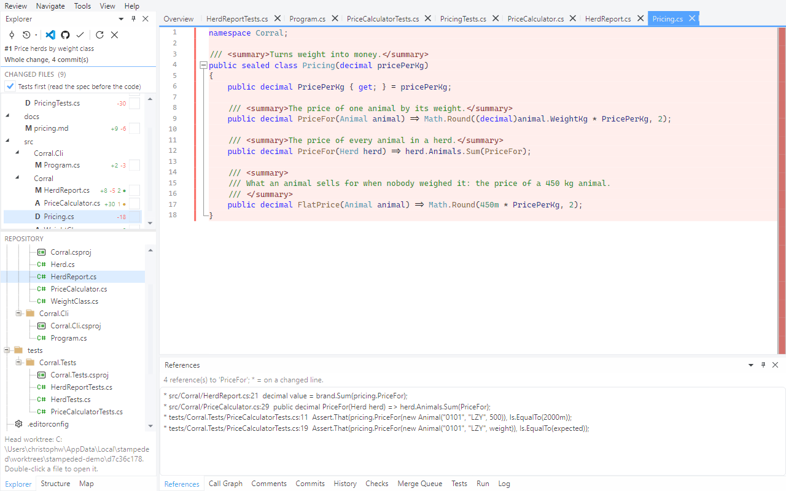
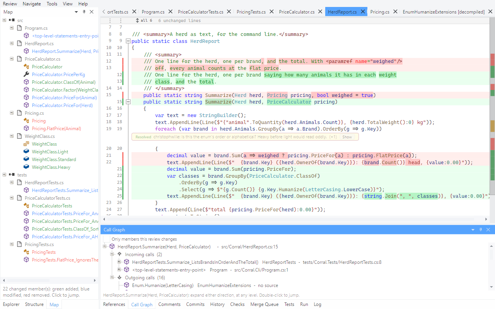
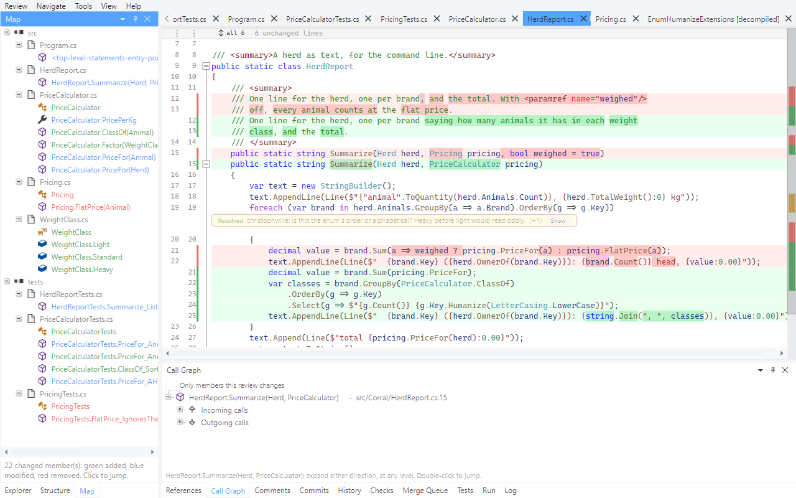

# Tour 2: Navigate the code in the diff

A web diff is text. Here, both sides of the diff are compiled: Roslyn loads the solution at
the pull request's head, plus a second view of it as it was at the merge base. So whatever
your IDE can tell you about a symbol, the diff can too - on added lines, context lines and
removed lines alike.

Open pull request #1 of the demo repository and go to `src/Corral/HerdReport.cs`. The
References pane tells you when the solution has loaded; for the demo that's a few seconds.

## 1. Hover

Rest the pointer on `ClassOf`.

Signature, doc comment and null state, same as in the IDE.

## 2. Go to definition

Put the caret on `ClassOf` and press `F12`, or Ctrl+click it.

If the target file is part of the change you land in its diff, otherwise in plain source.
`Alt+Left` takes you back, `Alt+Right` forward again.

## 3. Find references

`Shift+F12` on `PriceFor`.

A `*` marks the references on lines this pull request changes, so you can tell the call sites
the author touched from the ones that were left alone. Double-click to jump.

## 4. Go to definition from a removed line

One of the removed lines in `HerdReport.cs` calls `pricing.FlatPrice(a)`, a method this pull
request deletes. Put the caret on it and press `F12`.

You land in `Pricing.cs` as it was before the change - a file that doesn't exist at the head
any more. Hover and find references work there as well, so "what did this do, and who else
called it?" doesn't mean leaving the review.

## 5. Go to definition in a NuGet package

`F12` on `Humanize`, which comes from the Humanizer package.

No source in the repository, so the type is decompiled and opened read-only.

## 6. Call graph

Caret on `Summarize`, then **Navigate > Call Graph from Caret**.

Incoming and outgoing calls, expandable level by level. Tick **Only members this review
changes** to cut the graph down to the part the pull request is actually about.

## 7. Structure and Map

Two more panes share the Explorer's corner. **Structure** is the outline of the file in
front, with the members the change touches tinted:

**Map** lists every changed member of the pull request, grouped by file - green for added,
blue for modified, red for removed. One look tells you this change drops a method, adds an
enum and rewrites one function, before you've read a line of it:

Next: [Read it commit by commit](03-commit-by-commit.md)
