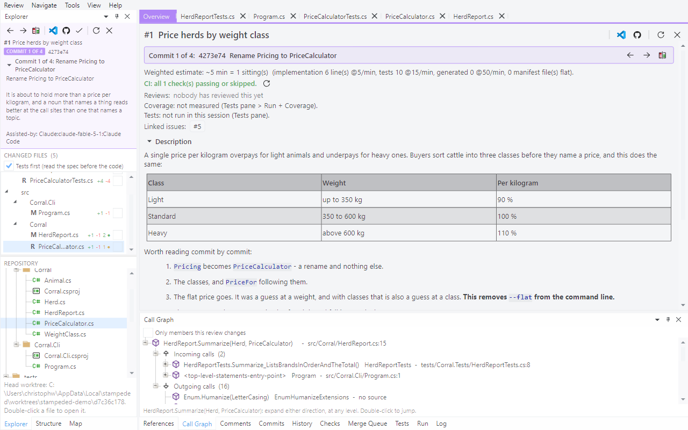

# Tour 3: Read it commit by commit

Some pull requests are a series: each commit one step, meant to be read in order. Pull
request #1 of the demo repository is four of them, and its description says what each is for.

## 1. Enter the commit scope

**Review > Commit by Commit**, or the first button in the Explorer's toolbar.

Everything goes purple, so you can't mistake one commit for the whole change. The Explorer
shows the commit message and only the files that commit touched, and the overview is
recomputed for it.

## 2. The rename, as a rename

Open `PriceCalculator.cs`.

In the whole change this file looked brand new (tour 1). In the commit that renamed it, it's
an `R` and a single changed line.

## 3. Step through the commits

`Ctrl+]` goes to the next commit, `Ctrl+[` to the previous one.

Viewed flags are kept per commit, so `v` works the way it does in the whole change. Comments
belong to the pull request: the thread on line 13 shows up in the commit that wrote that
line.

**Review > Whole Change** gets you out again. Try to approve with part of the series unread
and you'll be told so instead.

## 4. The Commits pane

Back in the whole change, open **Commits**.

Select a commit to see its files and full message. Double-click a file to see what that one
commit did to it, without switching scope.

## 5. Blame

Press `b`.

Both sides get blamed: a removed line shows the commit that originally wrote it, an added
line the commit of this pull request that added it. The margin is tinted by age, so the lines
this pull request wrote stand out from the ones it inherited.

## 6. File history

The **History** pane follows whatever file is in front.

It lists the commits that touched the file on the branch your clone has checked out - in
other words, where the file was before this change. Double-click a commit for its diff.
**Navigate > History of Selection** searches the same history for the commits that added or
removed the text you've selected.

Next: [Comment and submit](04-comment-and-submit.md)
