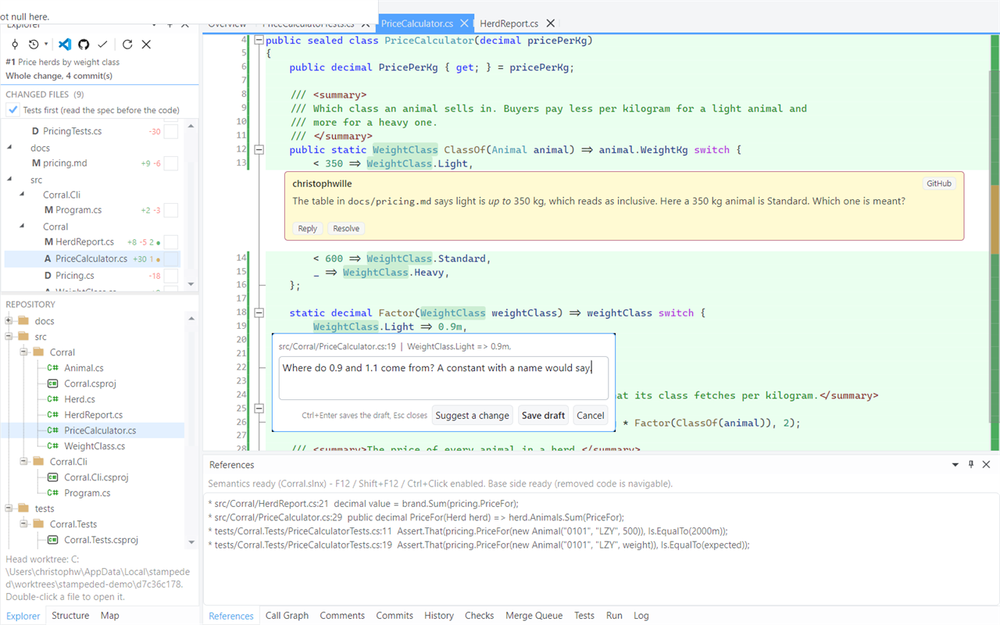
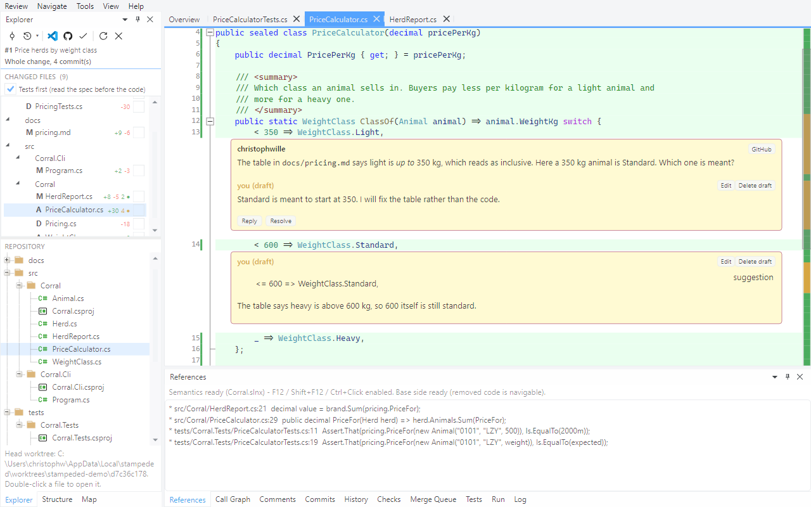
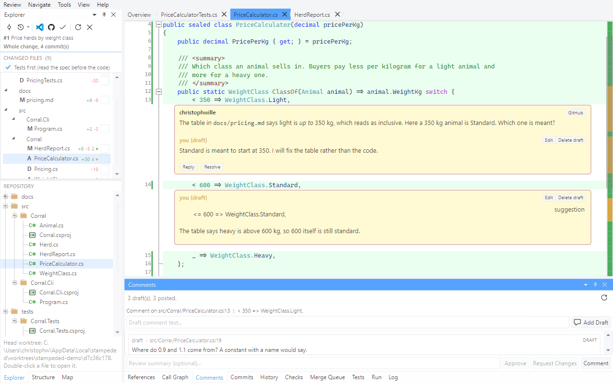
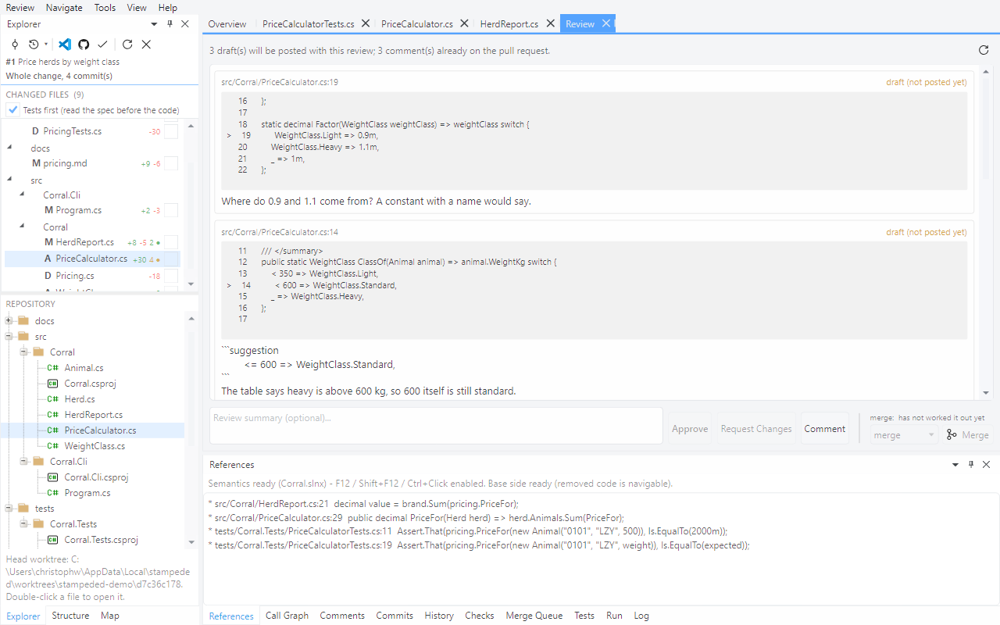
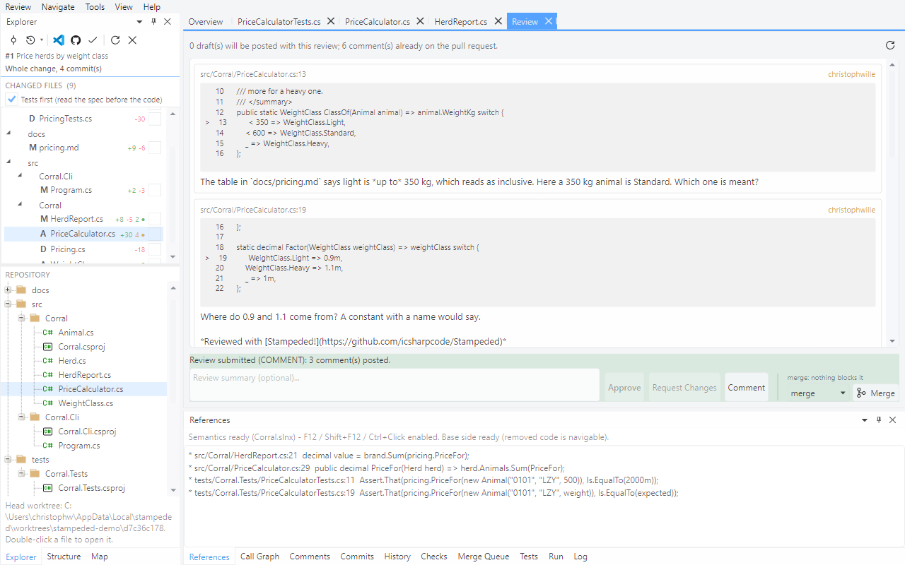

# Tour 4: Comment and submit

You write comments right where the code is, and they stay on your machine until you submit.
The author gets one review, not a drip of notifications.

Open pull request #1 of the demo repository and go to `src/Corral/PriceCalculator.cs`.

## 1. Existing threads

Threads from the host sit in the diff, under the line they're about, with Reply and Resolve
right there. The Explorer shows a count per file: amber while something is still open, green
once it's all settled.

## 2. Comment at the caret

Put the caret on a line and press `c`.

`Ctrl+Enter` saves, `Esc` closes. Once you've typed something, clicking into the code behind
the editor won't dismiss it and take your text with it.

## 3. Drafts

The draft sits where it will be posted, with Edit and Delete on it, and it's still there
after you close the app.

## 4. Suggest a change

`c` on another line, then **Suggest a change**. The editor is prefilled with a suggestion
block holding that line, ready for you to rewrite.

On GitHub the author can commit a suggestion with one click. Azure DevOps has no such thing,
so there it posts as a plain code block.

## 5. Reply

Click **Reply** on the posted thread.

Replies are drafts too.

## 6. The Comments pane and the review page

The **Comments** pane lists every draft and posted comment of the review. Double-click one to
go to it.

**Review > Approve / Request Changes...** opens the review page: each comment quoted with the
code around it, the way the author will see it. The summary goes in the box at the bottom.

## 7. Submit

**Comment** posts the three drafts as one review. **Approve** and **Request Changes** are
greyed out in this picture because it was taken by the pull request's own author, and GitHub
doesn't accept either verdict from the author. On somebody else's pull request they're live.

If a draft sits on a line the host would reject - outside the diff, or in a generated file -
it's kept as a local draft instead of sinking the whole review, and the result line tells you
how many were.

Next: [Come back after a force push](05-after-a-force-push.md)
