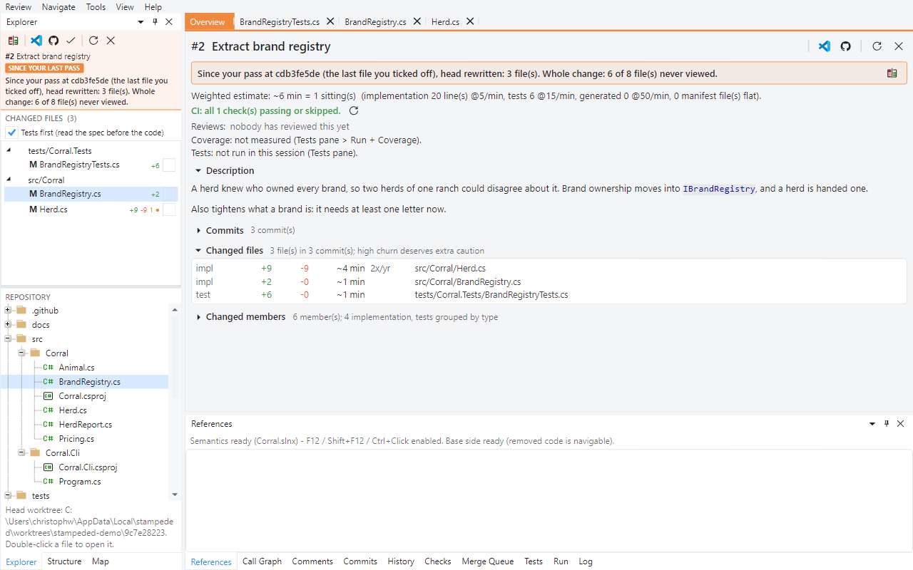

# Tour 5: Come back after a force push

You've read a pull request. Then the author rebases onto a newer `main`, amends a commit and
force-pushes. On the web you're more or less starting over: the commits you read are gone,
and "changes since your last review" is either unavailable or full of other people's work
that came along with the rebase.

This tour needs a push, so you can't follow it in the shared demo repository. Fork it and run
its `stage.ps1` if you want to try it yourself.

## 1. The first pass

Pull request #2, every file ticked off with `v`. There's one thread, on line 29 of `Herd.cs`.

## 2. The push

The author rebases onto `main` (which gained a commit in the meantime), moves `IsValidBrand`
to the end of its file and adds a third commit. `stage.ps1 -Push2` does exactly that.

Reload with `F5`, or simply open the pull request again.

The two files that read the same as before are still ticked. The other six are unticked
again - you did read them, just not as they are now - and `new!` flags a file that changed
since you did.

## 3. Since your last pass

**Review > Since Last Pass**.

Three files instead of eight, and in them only what the author actually edited. Whatever
`main` brought in through the rebase is not in this diff, even though it is part of the
difference between the two pushes.

The trick: this isn't old head against new head. The work you already read is replayed onto
the new base as a tree, and the new head is diffed against that. The window stays orange for
as long as you're in this scope.

**Review > Last Pass Was** lets you pick what counts as your last pass: the last file you
ticked off (the default, because opening a review isn't the same as reading it), your last
submitted review, or the last time you opened it.

## 4. Comments after the push

The thread was written against line 29 of a commit that's no longer on the branch. It now
sits on line 38: same statement, in the method that moved. When the host can no longer say
which line a comment belongs to, the line is found again by its content - and if that fails,
by the member it was written in.

Next: [CI, tests and coverage](06-ci-tests-coverage.md)
