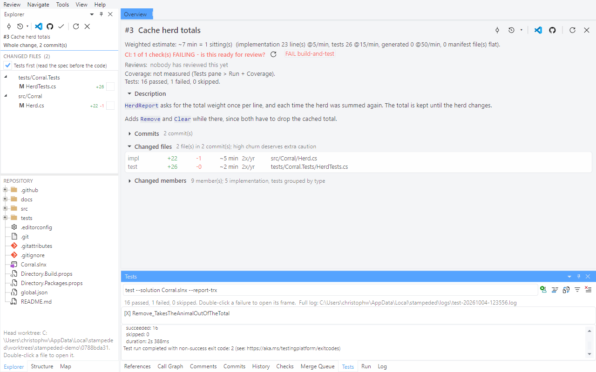

# Tour 6: CI, tests and coverage

A red check tells you something failed. This tour goes from there to the line that's wrong,
and to the lines no test ran at all - on the pull request's head, without checking anything
out.

Open pull request #3 of the demo repository. One of its tests fails on purpose.

## 1. Checks

The overview doesn't hide it: CI is failing, is this even ready for review? The **Checks**
pane lists the runs, failures first. Double-click a failed run and you get the log of the
step that failed, not the whole job.

## 2. Run the tests

**Tools > Run Tests**.

The tests run in the head worktree, so the result is the pull request's and your own checkout
stays out of it. Failures are listed above the live output; double-click one to open the
frame it failed in. The command line is yours to edit if you want a filter or a different
solution.

## 3. Coverage

**Tools > Run + Coverage**, then open `src/Corral/Herd.cs`.

The strip next to the line numbers is green where a test ran the line and red where none
did. `u` jumps to the next *added* line without coverage, and the Explorer shows how many
each file has (`5!`). Here, `Clear()` was added and no test ever calls it.

This wraps the run in `dotnet-coverage`, which you need to install once:
`dotnet tool install -g dotnet-coverage`.

## 4. Run A/B: base against head

**Tools > Run A/B (base vs head)**.

The tests run at the merge base and again at the head, and the result line is about the
difference: one test newly failing, none fixed, none already broken at the base. The two
outputs open as a diff.

**Tools > Impacted Test Filter** fills in a filter for the tests the change affects - handy
when the full suite is too slow to run for every review.

Next: [Review a local branch](07-local-branches.md)
