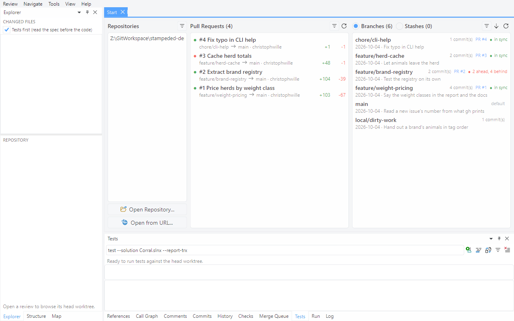
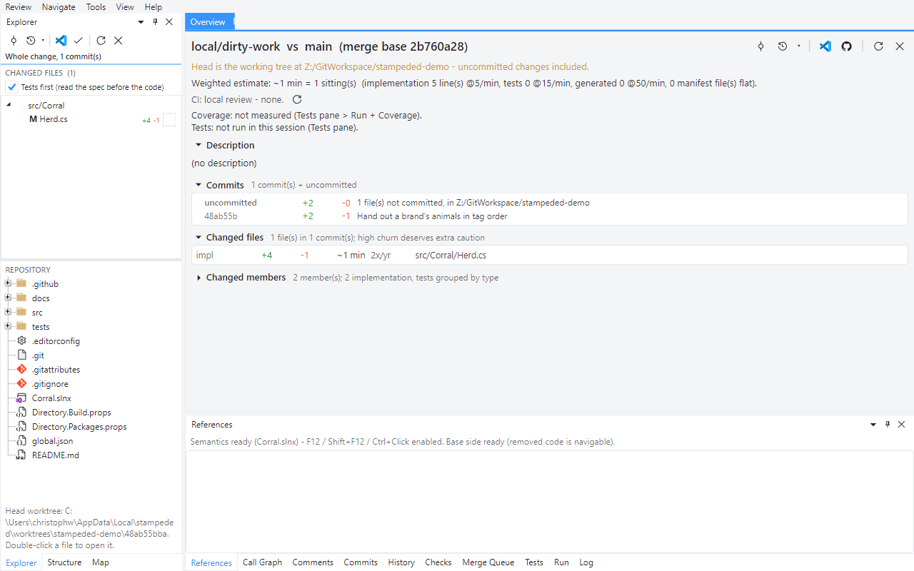

# Tour 7: Review a local branch

None of the earlier tours actually needs a pull request. You can review your own branch the
same way, before anyone else gets to see it.

In a clone of the demo repository, `./stage.ps1 -Local` sets up the branch for this tour:
`local/dirty-work`, one commit on top of an older `main`, plus an uncommitted edit.

## 1. Branches on the start page

**View > Start Page**.

Each branch shows its commit count, the pull request it belongs to and how it stands against
the remote: `in sync`, or - like `feature/brand-registry` here, after the force push of
tour 5 - `2 ahead, 4 behind`. The context menu can pull a branch from the remote without
checking it out. And if you left a rebase or merge unfinished, a banner here offers Resolve,
Continue, Skip and Abort.

## 2. Open the branch

Double-click `local/dirty-work`.

The review is the branch against its merge base with `main`. The branch is checked out and
the checkout is dirty, so the head is your working tree: the overview says so, and the commit
list has an `uncommitted` row above the one real commit.

## 3. Committed and uncommitted changes

`AverageWeight` isn't committed yet; the `OrderBy` is. Both read, navigate and fold like any
other change, so you get to catch what a reviewer would before there is a reviewer.

## 4. Run the application

**Tools > Run Application**.

The **Run** pane lists the executable projects in the review's worktree and runs the one you
pick, with arguments if it takes any.

Next: [Merge](08-merge.md)
