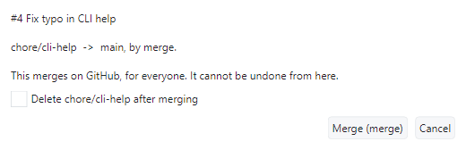

# Tour 8: Merge

Merging isn't a verdict, and the UI keeps it apart from the three buttons that are.

The demo repository has a one-line pull request for this, **Fix typo in CLI help**. It's #4
in the pictures, but its number changes every time the demo is staged again. Please don't
merge it in the shared repository - fork it if you want to follow along.

## 1. The merge state

**Review > Merge Pull Request...** opens the review page, where the merge block sits next to
the verdicts.

The line above the button answers "why can't I merge this?": failing checks, a missing
approval, a branch behind its target, a draft. You get two reasons at most, the rest is in
the tooltip. GitHub only works this out when somebody asks, so for a pull request nobody has
looked at yet the first answer is that it doesn't know; the refresh button at the top right
asks again.

The dropdown offers only the merge methods the repository allows, and remembers what you
picked.

## 2. Merge

A merge is for everyone and can't be taken back from here, so you're asked once - with the
method, both branches, and whether the head branch should go as well.

## 3. The merge queue

When several approved pull requests are waiting for the same target, every merge makes the
next one stale. The **Merge Queue** pane - at the bottom of the picture above - is a queue
shared by everyone who reviews the repository with this tool. It lives in a ref on the
remote, so there's no server and nothing to set up.

Add the pull request in front, with the merge method you want, and switch **Drive** on. It
merges the first entry that can be merged and skips the ones that can't, telling you why. If
an entry gets pushed to after it was queued, it has to be queued again. Entries that have
left the queue stay listed, with the reason.

## Offline

What only the host knows about a pull request - description, comments, checks - is cached
when you read it. Open the same pull request without a network and it's read from that cache
plus the commits already in your clone. The review tells you it's offline, and won't let you
submit or merge.

Back to the [index](README.md).
